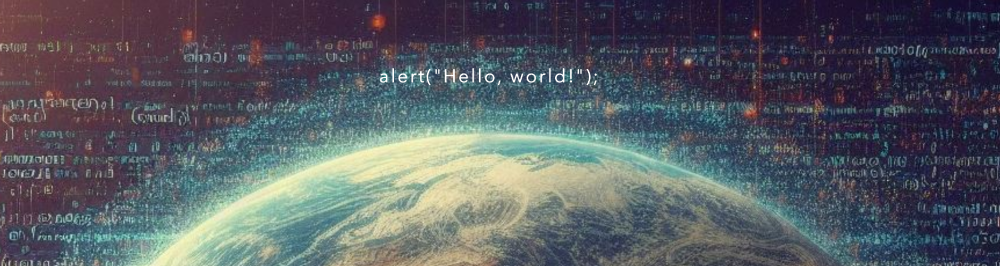

## 👍About me

Hello, world! I'm Andre Cantuaria, a software developer student at MITT (Manitoba Institute of 
Trades and Technology), currently based in Winnipeg, Canada.

I'm enthusiastic about coding, always embracing the creative and visual aspects of it. 
I enjoy creating awesome websites using CSS, HTML, and JavaScript and relish helping others
bring their interactive ideas to life. If you're into these techs too, let's explore them together!

## 🌱 My Skills

Feel free to check out my projects to see these skills in action!

## 💬 Say Hello!
Feel free to reach out to me through any of these channels:

I'm always up for a chat or to collaborate on cool projects.

<!--
**andrecantuaria/andrecantuaria** is a ✨ _special_ ✨ repository because its `README.md` (this file) appears on your GitHub profile.

Here are some ideas to get you started:

- 🔭 I’m currently working on ...
- 🌱 I’m currently learning ...
- 👯 I’m looking to collaborate on ...
- 🤔 I’m looking for help with ...
- 💬 Ask me about ...
- 📫 How to reach me: ...
- 😄 Pronouns: ...
- ⚡ Fun fact: ...
-->
